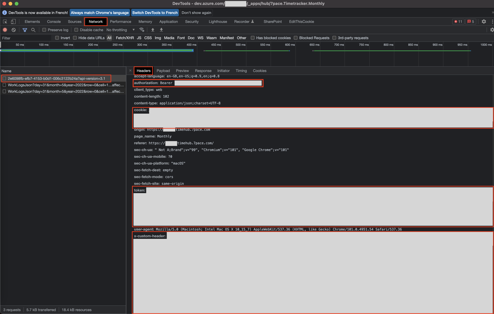
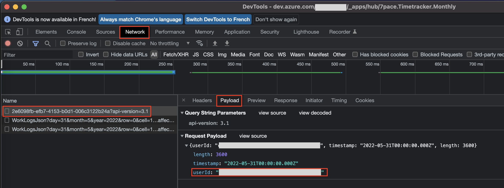

# 7pace-timetracker-autofill

Autofill 7pace timetracker in Azure DevOps for lazy people.

- [7pace-timetracker-autofill](#7pace-timetracker-autofill)
  - [How it works?](#how-it-works)
    - [Local installation](#local-installation)
      - [CLI mode](#cli-mode)
      - [Env file mode](#env-file-mode)
  - [Secrets](#secrets)
    - [Time tracker](#time-tracker)
    - [User ID](#user-id)
  - [License](#license)

## How it works?

### Local installation

- Download project

  ```bash
  # SSH
  git clone git@github.com:VictorRos/7pace-timetracker-autofill.git

  # HTTPS
  git clone https://github.com/VictorRos/7pace-timetracker-autofill.git
  ```

- Install NPM dependencies

  ```bash
  npm ci
  ```

#### CLI mode

- Run node script.

  ```bash
  node index.js \
    --start-date=<Start date YYYY-MM-DD> \
    --end-date=<End date YYYY-MM-DD (included)> \
    --user-id=<Your user ID> \
    --time-tracker-bearer-token=<Bearer Token retrieved from Chrome developer Tools> \
    --time-tracker-cookie=<Cookie retrieved from Chrome developer Tools> \
    --time-tracker-token=<Token retrieved from Chrome developer Tools> \
    --time-tracker-x-custom-header=<Token retrieved from Chrome developer Tools>
  ```

#### Env file mode

- Define an `.env` file in downloaded project.

  ```bash
  # Start and end dates
  TIME_TRACKER_START_DATE=<Start date YYYY-MM-DD>
  TIME_TRACKER_END_DATE=<End date YYYY-MM-DD (included)>

  # User ID
  TIME_TRACKER_USER_ID=<Your user ID>

  # Time tracker secrets
  TIME_TRACKER_BEARER_TOKEN=<Bearer Token retrieved from Chrome developer Tools>
  TIME_TRACKER_COOKIE=<Cookie retrieved from Chrome developer Tools>
  TIME_TRACKER_TOKEN=<Token retrieved from Chrome developer Tools>
  TIME_TRACKER_X_CUSTOM_HEADER=<Token retrieved from Chrome developer Tools>
  ```

- Run node script.

  ```bash
  node index.js
  ```

## Secrets

  1. Go to Monthly page

     https://dev.azure.com/ORGANIZATION/PROJECT/_apps/hub/7pace.Timetracker.Monthly

     Replace `ORGANIZATION` and `PROJECT` with yours.

  2. Open **Chrome developer Tools** when you are on Timetracker Monthly page.

  3. Go to **Network** tab, clear all entries.

  4. Select a day with existing work logs, click on **Edit** then click on **Save**.

  5. In **Network** entries, select the first one.

### Time tracker

From previous API call, retrieve:

- `TIME_TRACKER_BEARER_TOKEN` in request header **authorization** without **Bearer** and the space!
- `TIME_TRACKER_COOKIE` in request header **cookie**
- `TIME_TRACKER_TOKEN` in request header **token**
- `TIME_TRACKER_X_CUSTOM_HEADER` in request header **x-custom-header**



### User ID

From previous API call, retrieve `TIME_TRACKER_USER_ID` from **Payload**



## License

See [LICENSE](./LICENSE)
